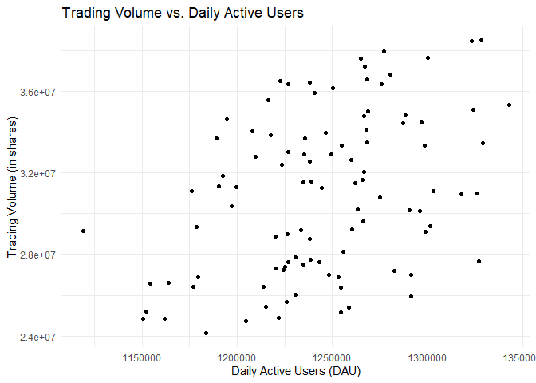
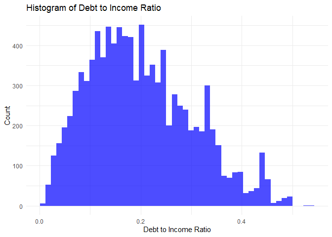
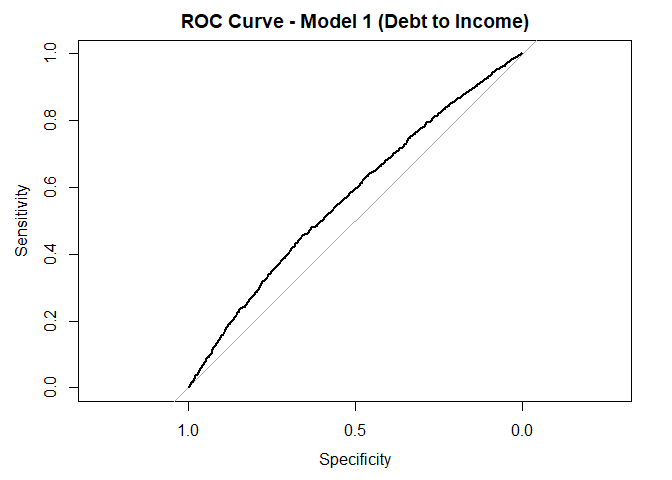
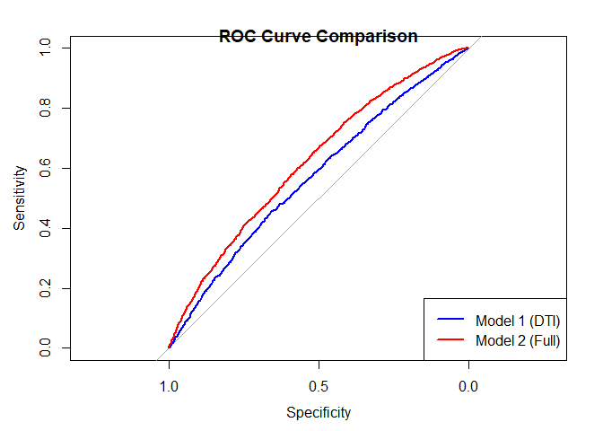

654 Group 4 Homework
================
Group 4
2025-10-31

## R Markdown

This is an R Markdown document. Markdown is a simple formatting syntax
for authoring HTML, PDF, and MS Word documents. For more details on
using R Markdown see <http://rmarkdown.rstudio.com>.

When you click the **Knit** button a document will be generated that
includes both content as well as the output of any embedded R code
chunks within the document. You can embed an R code chunk like this:

``` r
summary(cars)
```

    ##      speed           dist       
    ##  Min.   : 4.0   Min.   :  2.00  
    ##  1st Qu.:12.0   1st Qu.: 26.00  
    ##  Median :15.0   Median : 36.00  
    ##  Mean   :15.4   Mean   : 42.98  
    ##  3rd Qu.:19.0   3rd Qu.: 56.00  
    ##  Max.   :25.0   Max.   :120.00

## Including Plots

You can also embed plots, for example:

<!-- -->

Note that the `echo = FALSE` parameter was added to the code chunk to
prevent printing of the R code that generated the plot.

\#II. Daily active user and Trading volume on Robinhood

\#load the library

``` r
library(ggplot2)
```

    ## Warning: package 'ggplot2' was built under R version 4.4.3

\#Load dataset

``` r
robinhood_data <- read.csv("C:/Users/Sam/Desktop/UMass Sem III/AFT/Assignments/Group Homework/robinhood.csv")
head(robinhood_data)
```

    ##       Date Daily.Active.Users..DAU. Trading.Volume..Shares.Traded.
    ## 1 7/1/2024                  1274835                       30818001
    ## 2 7/2/2024                  1243086                       27622711
    ## 3 7/3/2024                  1282384                       27184814
    ## 4 7/4/2024                  1326151                       31000306
    ## 5 7/5/2024                  1238292                       36441815
    ## 6 7/6/2024                  1238293                       28768059

# — Question 1: Create a scatter plot —

``` r
ggplot(robinhood_data, aes(x = `Daily.Active.Users..DAU.`, y = `Trading.Volume..Shares.Traded.`)) +
  geom_point() +
  labs(title = "Trading Volume vs. Daily Active Users",
       x = "Daily Active Users (DAU)",
       y = "Trading Volume (in shares)") +
  theme_minimal()
```

<!-- -->
\# — Question 2: Perform linear regression —

``` r
model <- lm(`Trading.Volume..Shares.Traded.` ~ `Daily.Active.Users..DAU.`, data = robinhood_data)

summary(model)
```

    ## 
    ## Call:
    ## lm(formula = Trading.Volume..Shares.Traded. ~ Daily.Active.Users..DAU., 
    ##     data = robinhood_data)
    ## 
    ## Residuals:
    ##      Min       1Q   Median       3Q      Max 
    ## -6638607 -2830705   146840  2686288  6310680 
    ## 
    ## Coefficients:
    ##                            Estimate Std. Error t value Pr(>|t|)    
    ## (Intercept)              -1.244e+07  9.870e+06   -1.26    0.211    
    ## Daily.Active.Users..DAU.  3.487e+01  7.924e+00    4.40 2.75e-05 ***
    ## ---
    ## Signif. codes:  0 '***' 0.001 '**' 0.01 '*' 0.05 '.' 0.1 ' ' 1
    ## 
    ## Residual standard error: 3580000 on 98 degrees of freedom
    ## Multiple R-squared:  0.165,  Adjusted R-squared:  0.1565 
    ## F-statistic: 19.36 on 1 and 98 DF,  p-value: 2.752e-05

# Interpretation:

# Slope is 3.487e+01, which is scientific notation for 34.87.

# For every one additional daily active user, the trading volume is predicted to increase by 34.87 shares.

\#Predicting trading volume if daily active users is 1500000

``` r
# 1. Create a new data frame for the value we want to predict.
new_user_data <- data.frame(`Daily.Active.Users..DAU.` = 1500000)

# 2. Use the predict() function
predicted_volume <- predict(model, newdata = new_user_data)

# 3. Print the result
print(paste("Predicted trading volume for 1,500,000 DAU:", predicted_volume))
```

    ## [1] "Predicted trading volume for 1,500,000 DAU: 39863304.715444"

\#III. Predict consumer loan defaults \#Load Libraries

``` r
library(pROC)
```

    ## Warning: package 'pROC' was built under R version 4.4.3

    ## Type 'citation("pROC")' for a citation.

    ## 
    ## Attaching package: 'pROC'

    ## The following objects are masked from 'package:stats':
    ## 
    ##     cov, smooth, var

\#load Dataset

``` r
loan_data <- read.csv("C:/Users/Sam/Desktop/UMass Sem III/AFT/Assignments/Group Homework/pslcdata.csv")
head(loan_data)
```

    ##   id loan_amnt int_rate grade sub_grade emp_length revol_bal revol_util fico
    ## 1  1     17625    18.49     D        D2    3 years     12002       88.9  672
    ## 2  2      2800     7.62     A        A3    4 years      3897       73.5  727
    ## 3  3      5375    15.31     C        C2    3 years      6070       38.4  682
    ## 4  4     20000    14.09     B        B5   < 1 year     12174       49.9  702
    ## 5  5     10000    12.12     B        B3  10+ years     13547       88.6  707
    ## 6  6     20000    18.49     D        D2  10+ years     23178       87.8  677
    ##   home_ownership annual_inc verification_status loan_status default
    ## 1           RENT      45000            Verified  Fully Paid    Paid
    ## 2           RENT      44500        Not Verified  Fully Paid    Paid
    ## 3            OWN      22880            Verified  Fully Paid    Paid
    ## 4           RENT      95000            Verified  Fully Paid    Paid
    ## 5           RENT      68000        Not Verified  Fully Paid    Paid
    ## 6       MORTGAGE      60000            Verified  Fully Paid    Paid

# Create ‘default.dummy’

``` r
loan_data$default.dummy <- ifelse(loan_data$default == "Defaulted", 1, 0)
print(table(loan_data$default.dummy))
```

    ## 
    ##    0    1 
    ## 8377 1623

# Create ‘debt_to_income’ and plot histogram

``` r
loan_data$debt_to_income <- loan_data$loan_amnt / loan_data$annual_inc
```

# Plot histogram

``` r
print(
  ggplot(loan_data, aes(x = debt_to_income)) +
    geom_histogram(bins = 50, fill = "blue", alpha = 0.7) +
    labs(title = "Histogram of Debt to Income Ratio",
         x = "Debt to Income Ratio",
         y = "Count") +
    theme_minimal()
)
```

<!-- -->

# Estimate Logistic Regression (Model 1)

``` r
model1 <- glm(default.dummy ~ debt_to_income, data = loan_data, family = "binomial")
```

# Report the estimates

``` r
print("Model 1 Summary")
```

    ## [1] "Model 1 Summary"

``` r
summary(model1)
```

    ## 
    ## Call:
    ## glm(formula = default.dummy ~ debt_to_income, family = "binomial", 
    ##     data = loan_data)
    ## 
    ## Coefficients:
    ##                Estimate Std. Error z value Pr(>|z|)    
    ## (Intercept)    -2.12174    0.06234 -34.033   <2e-16 ***
    ## debt_to_income  2.31572    0.26013   8.902   <2e-16 ***
    ## ---
    ## Signif. codes:  0 '***' 0.001 '**' 0.01 '*' 0.05 '.' 0.1 ' ' 1
    ## 
    ## (Dispersion parameter for binomial family taken to be 1)
    ## 
    ##     Null deviance: 8869.3  on 9999  degrees of freedom
    ## Residual deviance: 8791.0  on 9998  degrees of freedom
    ## AIC: 8795
    ## 
    ## Number of Fisher Scoring iterations: 4

# ROC Curve and AUC (Model 1)

``` r
prob1 <- predict(model1, type = "response")
roc1 <- roc(loan_data$default.dummy, prob1)
```

    ## Setting levels: control = 0, case = 1

    ## Setting direction: controls < cases

# Plot the ROC curve

``` r
plot(roc1, main = "ROC Curve - Model 1 (Debt to Income)")
```

<!-- -->

# Print the AUC (Area Under the Curve)

``` r
print("Model 1 AUC")
```

    ## [1] "Model 1 AUC"

``` r
print(auc(roc1))
```

    ## Area under the curve: 0.5697

# 5: Policy Evaluation (Model 1 @ 20% Threshold)

``` r
pred1_class <- ifelse(prob1 > 0.20, 1, 0)
conf_matrix1 <- table(Actual = loan_data$default.dummy, Predicted = pred1_class)

print("--- Part 5: Confusion Matrix (Model 1 @ 0.20) ---")
```

    ## [1] "--- Part 5: Confusion Matrix (Model 1 @ 0.20) ---"

``` r
print(conf_matrix1)
```

    ##       Predicted
    ## Actual    0    1
    ##      0 7220 1157
    ##      1 1290  333

# 5.1) Proportion correctly predicted to default (True Positive Rate)

``` r
tpr1 <- conf_matrix1[2, 2] / sum(conf_matrix1[2, ])
print(paste("5.1: Proportion correctly predicted to default (TPR):", tpr1))
```

    ## [1] "5.1: Proportion correctly predicted to default (TPR): 0.205175600739372"

# 5.2) Proportion mistakenly predicted to default (False Positive Rate)

``` r
fpr1 <- conf_matrix1[1, 2] / sum(conf_matrix1[1, ])
print(paste("5.2: Proportion mistakenly predicted to default (FPR):", fpr1))
```

    ## [1] "5.2: Proportion mistakenly predicted to default (FPR): 0.138116270741315"

# 6: Estimate Logistic Regression (Model 2)

``` r
model2 <- glm(default.dummy ~ fico + debt_to_income + revol_bal, 
              data = loan_data, family = "binomial")
```

# Report the estimates

``` r
print("6: Model 2 Summary")
```

    ## [1] "6: Model 2 Summary"

``` r
summary(model2)
```

    ## 
    ## Call:
    ## glm(formula = default.dummy ~ fico + debt_to_income + revol_bal, 
    ##     family = "binomial", data = loan_data)
    ## 
    ## Coefficients:
    ##                  Estimate Std. Error z value Pr(>|z|)    
    ## (Intercept)     7.397e+00  7.665e-01   9.650   <2e-16 ***
    ## fico           -1.373e-02  1.109e-03 -12.381   <2e-16 ***
    ## debt_to_income  2.377e+00  2.633e-01   9.027   <2e-16 ***
    ## revol_bal       8.246e-07  1.087e-06   0.759    0.448    
    ## ---
    ## Signif. codes:  0 '***' 0.001 '**' 0.01 '*' 0.05 '.' 0.1 ' ' 1
    ## 
    ## (Dispersion parameter for binomial family taken to be 1)
    ## 
    ##     Null deviance: 8869.3  on 9999  degrees of freedom
    ## Residual deviance: 8612.7  on 9996  degrees of freedom
    ## AIC: 8620.7
    ## 
    ## Number of Fisher Scoring iterations: 5

# Part 7: ROC Curve and AUC (Model 2)

``` r
prob2 <- predict(model2, type = "response")
roc2 <- roc(loan_data$default.dummy, prob2)
```

    ## Setting levels: control = 0, case = 1

    ## Setting direction: controls < cases

# Plot both ROC curves to compare

``` r
plot(roc1, col = "blue")
plot(roc2, col = "red", add = TRUE)
legend("bottomright", legend = c("Model 1 (DTI)", "Model 2 (Full)"), 
       col = c("blue", "red"), lwd = 2)
title("ROC Curve Comparison")
```

<!-- -->

# Print and compare the AUC values

``` r
print("Part 7: AUC Comparison")
```

    ## [1] "Part 7: AUC Comparison"

``` r
print(paste("Model 1 AUC (DTI only):", auc(roc1)))
```

    ## [1] "Model 1 AUC (DTI only): 0.569684281352772"

``` r
print(paste("Model 2 AUC (Full model):", auc(roc2)))
```

    ## [1] "Model 2 AUC (Full model): 0.620385556762049"

# Part 8: Policy Evaluation (Model 2 @ 10% Threshold)

``` r
pred2_class <- ifelse(prob2 > 0.10, 1, 0)
conf_matrix2 <- table(Actual = loan_data$default.dummy, Predicted = pred2_class)

print("--- Part 8: Confusion Matrix (Model 2 @ 0.10) ---")
```

    ## [1] "--- Part 8: Confusion Matrix (Model 2 @ 0.10) ---"

``` r
print(conf_matrix2)
```

    ##       Predicted
    ## Actual    0    1
    ##      0 1272 7105
    ##      1  108 1515

# 8.1) Proportion correctly predicted to default (True Positive Rate)

``` r
tpr2 <- conf_matrix2[2, 2] / sum(conf_matrix2[2, ])
print(paste("8.1) Proportion correctly predicted to default (TPR):", tpr2))
```

    ## [1] "8.1) Proportion correctly predicted to default (TPR): 0.933456561922366"

# 8.2) Proportion mistakenly predicted to default (False Positive Rate)

``` r
fpr2 <- conf_matrix2[1, 2] / sum(conf_matrix2[1, ])
print(paste("8.2) Proportion mistakenly predicted to default (FPR):", fpr2))
```

    ## [1] "8.2) Proportion mistakenly predicted to default (FPR): 0.848155664318969"
