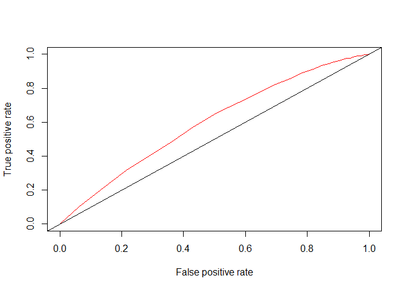
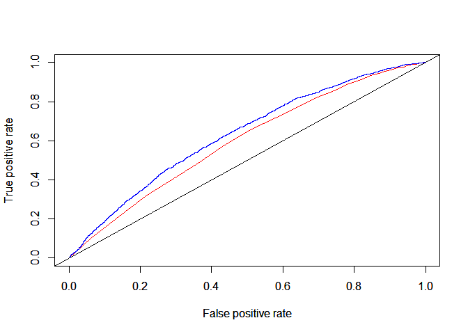

R coding Demo– Fintech and Lending
================
Professor Lina Han

In this question, we will build a credit model and use it to predict
consumer default loan defaults. Specifically,we will study how the
performance of default prediction will change when we introduce more
information available.

We will start with a sample database of 10,000 three-year consumer
loans - “pslcdata.csv”. The database contains the following details for
each borrower: ID, Loan Amount, Interest Rate (annual in percentage),
Credit Grade, Detailed Credit Grade, Length of Employment, Revolving
Credit Balance, Revolving Credit Utility (in percentage), FICO score,
Home Ownership Status, Annual Income, Employment Verification, Loan
Status and Default status of the loan.

## 1: Basic Model Estimate - the case with FICO score only

In this part, we will work with *fico score only* and see how that
predicts default.

1)  Transform variable default into a format that R can understand. (1
    for default and 0 for non-default).

``` r
# You can install and read in packages here
library(data.table)

# load data, change to your own data folder

setwd("C:/Users/Sam/Desktop/UMass Sem III/AFT/R demo")
X <- read.csv("pslcdata.csv")

# lets have a look at the data
colnames(X)
```

    ##  [1] "id"                  "loan_amnt"           "int_rate"           
    ##  [4] "grade"               "sub_grade"           "emp_length"         
    ##  [7] "revol_bal"           "revol_util"          "fico"               
    ## [10] "home_ownership"      "annual_inc"          "verification_status"
    ## [13] "loan_status"         "default"

``` r
# the default variable
unique(X$default)
```

    ## [1] "Paid"      "Defaulted"

``` r
# create a binary outcome variable
X$default_dummy[!X$default=="Defaulted"] <- 0
X$default_dummy[X$default=="Defaulted"] <- 1


# lets have a look at the data again
summary(X)
```

    ##        id          loan_amnt        int_rate        grade          
    ##  Min.   :    1   Min.   : 1000   Min.   : 6.03   Length:10000      
    ##  1st Qu.: 2501   1st Qu.: 7000   1st Qu.:10.16   Class :character  
    ##  Median : 5000   Median :10000   Median :13.11   Mode  :character  
    ##  Mean   : 5000   Mean   :12222   Mean   :13.20                     
    ##  3rd Qu.: 7500   3rd Qu.:16000   3rd Qu.:15.80                     
    ##  Max.   :10000   Max.   :35000   Max.   :25.80                     
    ##                                                                    
    ##   sub_grade          emp_length          revol_bal         revol_util    
    ##  Length:10000       Length:10000       Min.   :      0   Min.   :  0.00  
    ##  Class :character   Class :character   1st Qu.:   6544   1st Qu.: 41.20  
    ##  Mode  :character   Mode  :character   Median :  11364   Median : 59.30  
    ##                                        Mean   :  15065   Mean   : 57.18  
    ##                                        3rd Qu.:  18640   3rd Qu.: 75.50  
    ##                                        Max.   :1746716   Max.   :106.90  
    ##                                                          NA's   :11      
    ##       fico       home_ownership       annual_inc      verification_status
    ##  Min.   :662.0   Length:10000       Min.   :   7000   Length:10000       
    ##  1st Qu.:677.0   Class :character   1st Qu.:  42000   Class :character   
    ##  Median :692.0   Mode  :character   Median :  60000   Mode  :character   
    ##  Mean   :698.9                      Mean   :  68980                      
    ##  3rd Qu.:712.0                      3rd Qu.:  84000                      
    ##  Max.   :847.5                      Max.   :1200000                      
    ##                                                                          
    ##  loan_status          default          default_dummy   
    ##  Length:10000       Length:10000       Min.   :0.0000  
    ##  Class :character   Class :character   1st Qu.:0.0000  
    ##  Mode  :character   Mode  :character   Median :0.0000  
    ##                                        Mean   :0.1623  
    ##                                        3rd Qu.:0.0000  
    ##                                        Max.   :1.0000  
    ## 

2)  Before estimating the model, what sign do we expect to see for the
    coefficient of fico score in a logistic regression?

3)  Write an R script to estimate a *logistic regression* model with
    FICO score as predictor.

``` r
logit <- glm(data=X, formula=default_dummy~fico, family=binomial(link="logit"))
summary(logit)
```

    ## 
    ## Call:
    ## glm(formula = default_dummy ~ fico, family = binomial(link = "logit"), 
    ##     data = X)
    ## 
    ## Coefficients:
    ##              Estimate Std. Error z value Pr(>|z|)    
    ## (Intercept)  7.681073   0.755259   10.17   <2e-16 ***
    ## fico        -0.013414   0.001092  -12.29   <2e-16 ***
    ## ---
    ## Signif. codes:  0 '***' 0.001 '**' 0.01 '*' 0.05 '.' 0.1 ' ' 1
    ## 
    ## (Dispersion parameter for binomial family taken to be 1)
    ## 
    ##     Null deviance: 8869.3  on 9999  degrees of freedom
    ## Residual deviance: 8694.0  on 9998  degrees of freedom
    ## AIC: 8698
    ## 
    ## Number of Fisher Scoring iterations: 5

## 2: Model Evaluation

Now that we have the first fitted model, we want to evaluate its
usefulness.

1)  Use the model to estimate the *probability* of each loan’s default.

``` r
X$pred <- predict(object=logit,data=X, type="response")

head(X$pred)
```

    ## [1] 0.2086184 0.1119421 0.1873358 0.1498600 0.1415141 0.1977614

2)  Use the probability estimated, create an *ROC* curve plot. Use the
    code provided below for solving this part of the problem.

``` r
# there are many ways to do this a lot shorter, this is meant to be step-by-step

#install.packages("ROCR")
library(ROCR)
```

    ## Warning: package 'ROCR' was built under R version 4.4.3

``` r
pred <- prediction(X$pred, X$default_dummy)
perf <- performance(pred,"tpr","fpr")

plot(perf,col="red")

abline(c(0,0),c(1,1))
```

<!-- -->

3)  What is the area under the curve? Is the area below your *ROC* curve
    greater than 0.5?

``` r
auc_ROCR <- performance(pred, measure = "auc")
auc_ROCR@y.values[[1]]
```

    ## [1] 0.5981371

4)  Suppose we develop a policy that rejects all the loan applicants
    whose predicted probability of default is greater than 10%. What is
    the proportion of consumers you correctly reject? (TPR,The
    denominator should be the total number of people who defaulted.)
    What is the proportion of consumers you mistakenly reject? (FPR,The
    denominator should be total number of people who do not default.)

``` r
# create a variable with the default predictions 
X$pred_def <- F
X$pred_def[X$pred>=0.1] <- T

# number of people who default
print(paste("Number of defaults",sum(X$default_dummy)))
```

    ## [1] "Number of defaults 1623"

``` r
# true positives, i.e. people who were rejected and also defaulted
print(paste("True positives:",sum(X$default_dummy==1 & X$pred_def>=0.1)))
```

    ## [1] "True positives: 1534"

``` r
# true positive rate
print(paste("True positives:", sum(X$default_dummy==1 & X$pred_def>=0.1)/sum(X$default_dummy)))
```

    ## [1] "True positives: 0.945163277880468"

``` r
# total number of people who do not default
num_neg <- sum(!X$default_dummy)
print(paste("Total number of people who do not default:",num_neg))
```

    ## [1] "Total number of people who do not default: 8377"

``` r
# false positives, i.e. people who where rejected at the 10% threshold but did not default
num_false_pos <- sum(!X$default_dummy[X$pred_def])
print(paste("False positive number:",num_false_pos))
```

    ## [1] "False positive number: 7282"

``` r
print(paste("Proportion of people mistakenly rejected:",num_false_pos/num_neg))
```

    ## [1] "Proportion of people mistakenly rejected: 0.869284946878357"

## 3: With Slightly Richer Data

In this part, you are expected to conduct some further analysis taking
advantage of the additional variables available. You are expected to run
a logistic regression with *fico, loan amount, interest rate, detailed
credit grade, revolving credit balance, employment verification status
and Lending club’s sub grade.* The employment verification should be
treated as two groups: non-verified and everything else.

1)  Which variables should be transformed to factors in R?

``` r
summary(X)
```

    ##        id          loan_amnt        int_rate        grade          
    ##  Min.   :    1   Min.   : 1000   Min.   : 6.03   Length:10000      
    ##  1st Qu.: 2501   1st Qu.: 7000   1st Qu.:10.16   Class :character  
    ##  Median : 5000   Median :10000   Median :13.11   Mode  :character  
    ##  Mean   : 5000   Mean   :12222   Mean   :13.20                     
    ##  3rd Qu.: 7500   3rd Qu.:16000   3rd Qu.:15.80                     
    ##  Max.   :10000   Max.   :35000   Max.   :25.80                     
    ##                                                                    
    ##   sub_grade          emp_length          revol_bal         revol_util    
    ##  Length:10000       Length:10000       Min.   :      0   Min.   :  0.00  
    ##  Class :character   Class :character   1st Qu.:   6544   1st Qu.: 41.20  
    ##  Mode  :character   Mode  :character   Median :  11364   Median : 59.30  
    ##                                        Mean   :  15065   Mean   : 57.18  
    ##                                        3rd Qu.:  18640   3rd Qu.: 75.50  
    ##                                        Max.   :1746716   Max.   :106.90  
    ##                                                          NA's   :11      
    ##       fico       home_ownership       annual_inc      verification_status
    ##  Min.   :662.0   Length:10000       Min.   :   7000   Length:10000       
    ##  1st Qu.:677.0   Class :character   1st Qu.:  42000   Class :character   
    ##  Median :692.0   Mode  :character   Median :  60000   Mode  :character   
    ##  Mean   :698.9                      Mean   :  68980                      
    ##  3rd Qu.:712.0                      3rd Qu.:  84000                      
    ##  Max.   :847.5                      Max.   :1200000                      
    ##                                                                          
    ##  loan_status          default          default_dummy         pred        
    ##  Length:10000       Length:10000       Min.   :0.0000   Min.   :0.02442  
    ##  Class :character   Class :character   1st Qu.:0.0000   1st Qu.:0.13356  
    ##  Mode  :character   Mode  :character   Median :0.0000   Median :0.16776  
    ##                                        Mean   :0.1623   Mean   :0.16230  
    ##                                        3rd Qu.:0.0000   3rd Qu.:0.19776  
    ##                                        Max.   :1.0000   Max.   :0.23163  
    ##                                                                          
    ##   pred_def      
    ##  Mode :logical  
    ##  FALSE:1184     
    ##  TRUE :8816     
    ##                 
    ##                 
    ##                 
    ## 

``` r
# converting category variables to dummy: verification status
X$verification <- 1L
X$verification[X$verification_status=="Not Verified"] <- 0L
```

2)  Run a logistic regression using the explanatory variables listed
    above. Report your logistic regression results.

``` r
logit2 <- glm(data=X, formula=default_dummy~fico+loan_amnt+int_rate+revol_bal+verification, family=binomial(link="logit"))
summary(logit2)
```

    ## 
    ## Call:
    ## glm(formula = default_dummy ~ fico + loan_amnt + int_rate + revol_bal + 
    ##     verification, family = binomial(link = "logit"), data = X)
    ## 
    ## Coefficients:
    ##                Estimate Std. Error z value Pr(>|z|)    
    ## (Intercept)  -5.565e-02  1.009e+00  -0.055  0.95603    
    ## fico         -4.276e-03  1.344e-03  -3.182  0.00146 ** 
    ## loan_amnt    -1.526e-06  4.058e-06  -0.376  0.70679    
    ## int_rate      9.962e-02  9.069e-03  10.984  < 2e-16 ***
    ## revol_bal     1.003e-06  9.809e-07   1.023  0.30648    
    ## verification  2.232e-02  5.869e-02   0.380  0.70374    
    ## ---
    ## Signif. codes:  0 '***' 0.001 '**' 0.01 '*' 0.05 '.' 0.1 ' ' 1
    ## 
    ## (Dispersion parameter for binomial family taken to be 1)
    ## 
    ##     Null deviance: 8869.3  on 9999  degrees of freedom
    ## Residual deviance: 8573.0  on 9994  degrees of freedom
    ## AIC: 8585
    ## 
    ## Number of Fisher Scoring iterations: 5

3)  Create new default predictions from this richer model and plot an
    ROC curve.

``` r
# new default probability estimates
X$pred1 <- predict(object=logit2, type="response")

# ROC curve
pred1 <- prediction(X$pred1, X$default_dummy)
perf1 <- performance(pred1,"tpr","fpr")

plot(perf,col = "red")
par(new=TRUE)
plot(perf1,col = "blue")

abline(c(0,0),c(1,1))
```

<!-- -->

4)  Is the area below your new ROC curve greater than that in part 2?
    Report the area. Interpret the differences.

``` r
auc_ROCR <- performance(pred1, measure = "auc")
auc_ROCR@y.values[[1]]
```

    ## [1] 0.6320422

``` r
#print(auc)
```
