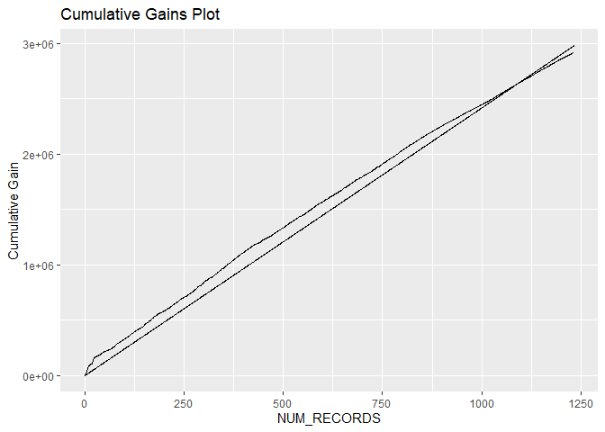
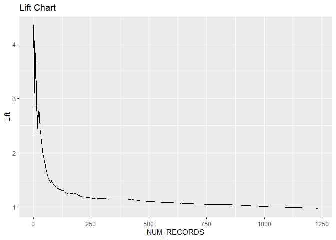

Individual Assignment 3
================
Samarth
2025-03-02

\##1. Loading packages:

``` r
library(caret)
```

    ## Warning: package 'caret' was built under R version 4.4.3

    ## Loading required package: ggplot2

    ## Warning: package 'ggplot2' was built under R version 4.4.3

    ## Loading required package: lattice

``` r
library(ggplot2)
library(dplyr)
```

    ## Warning: package 'dplyr' was built under R version 4.4.3

    ## 
    ## Attaching package: 'dplyr'

    ## The following objects are masked from 'package:stats':
    ## 
    ##     filter, lag

    ## The following objects are masked from 'package:base':
    ## 
    ##     intersect, setdiff, setequal, union

\##2. Importing data:

``` r
beachattendance <- read.csv("C:/Users/Sam/Desktop/UMass Sem II/655 ML for A/Assignments/Individual Assignment 3/Beach Attendance.csv") 
```

\##5. Partitioning between training, validation, and test

``` r
sample <- sample.int(n = nrow(beachattendance), size = nrow(beachattendance)*0.70, replace = F)
Beach_TRAINING <- beachattendance[sample, ] ##Yields training dataset
Beach_VALIDATION <- beachattendance[-sample, ] ##Yields validation & test portion

sample <- sample.int(n = nrow(Beach_VALIDATION), size = nrow(Beach_VALIDATION)*0.15, replace = F) ##Validation percentage = what percentage of this validation + test block should go into validation
Beach_VALIDATION_SET <- Beach_VALIDATION[sample, ] ##Yields validation dataset
Beach_TEST_SET <- Beach_VALIDATION[-sample, ] ##Yields test portion
```

``` r
head(beachattendance)
```

    ##   Observation.ID Beach.ID Daily.Attendance Month Latitude Longitude Is.Holiday
    ## 1              1        3             3826     1    52.89    20.777          0
    ## 2              2        3             2862     1    52.89    20.777          0
    ## 3              3        3             3895     1    52.89    20.777          0
    ## 4              4        3             3354     1    52.89    20.777          0
    ## 5              5        3             3017     1    52.89    20.777          0
    ## 6              6        3             3458     1    52.89    20.777          0
    ##   Is.Weekend Rain.Index AverageTemperature Wave.Action
    ## 1          0        0.0                 84         0.0
    ## 2          0        0.0                 83         0.0
    ## 3          0        0.0                 70         0.0
    ## 4          0       10.9                 87        65.4
    ## 5          1        0.0                 84         0.0
    ## 6          0        0.0                 63         0.0

\##6. Train linear regression model  

``` r
linear_regression_model <- lm(Daily.Attendance ~ Month + Latitude + Longitude + Is.Holiday + Is.Weekend + Rain.Index + AverageTemperature + Wave.Action , data=Beach_TRAINING) ##Or, can use all predictors except one using the ~ . -EXCLUDEDVARIABLE notation
summary(linear_regression_model) ##Outputs summary of model & coefficients
```

    ## 
    ## Call:
    ## lm(formula = Daily.Attendance ~ Month + Latitude + Longitude + 
    ##     Is.Holiday + Is.Weekend + Rain.Index + AverageTemperature + 
    ##     Wave.Action, data = Beach_TRAINING)
    ## 
    ## Residuals:
    ##     Min      1Q  Median      3Q     Max 
    ## -9198.6  -620.0    -7.5   523.1 19827.8 
    ## 
    ## Coefficients:
    ##                      Estimate Std. Error t value Pr(>|t|)    
    ## (Intercept)        111993.651  16775.257   6.676 2.86e-11 ***
    ## Month                 -63.750      6.384  -9.986  < 2e-16 ***
    ## Latitude            -1132.516    170.885  -6.627 3.96e-11 ***
    ## Longitude           -2412.021    375.724  -6.420 1.56e-10 ***
    ## Is.Holiday            186.287     53.213   3.501  0.00047 ***
    ## Is.Weekend            408.496     64.190   6.364 2.23e-10 ***
    ## Rain.Index             26.955      5.072   5.314 1.14e-07 ***
    ## AverageTemperature      4.194      2.029   2.067  0.03877 *  
    ## Wave.Action            12.483      1.789   6.978 3.58e-12 ***
    ## ---
    ## Signif. codes:  0 '***' 0.001 '**' 0.01 '*' 0.05 '.' 0.1 ' ' 1
    ## 
    ## Residual standard error: 1363 on 3370 degrees of freedom
    ## Multiple R-squared:  0.1042, Adjusted R-squared:  0.1021 
    ## F-statistic: 49.02 on 8 and 3370 DF,  p-value: < 2.2e-16

\#Ans.\[5\] Variables, positively correlated with daily attendence:
Is.Holiday, Is.Weekend, Rain.Index, AverageTemperature and Wave.Action
Variables, nagatively correlated with daily attendence: Month, Latitude
and Longitude

\##Ans.\[6\] R-squared on training data: 0.08939

\##7 Produce predictions on validation & test data using linear
regression model

``` r
Beach_VALIDATION_PREDICTIONS <- predict(linear_regression_model, newdata=Beach_VALIDATION_SET)
Beach_VALIDATION_SET$LINEAR_PRED = Beach_VALIDATION_PREDICTIONS ##saves predictions into validation dataframe

Beach_TEST_PREDICTIONS <- predict(linear_regression_model, newdata=Beach_TEST_SET)
Beach_TEST_SET$LINEAR_PRED = Beach_TEST_PREDICTIONS ##saves prediction into test set dataframe
```

\##8. Evaluate predictions on validation & test data: Caret package must
be loaded to call this function!

``` r
postResample(pred = Beach_VALIDATION_SET$LINEAR_PRED, obs = Beach_VALIDATION_SET$Daily.Attendance) ##evaluating validation predictions
```

    ##         RMSE     Rsquared          MAE 
    ## 1889.8136853    0.2301456  884.1756496

``` r
postResample(pred = Beach_TEST_SET$LINEAR_PRED, obs = Beach_TEST_SET$Daily.Attendance) ##evaluating test predictions
```

    ##        RMSE    Rsquared         MAE 
    ## 1442.159480    0.103968  849.918202

\##9. Manually calculate prediction error & error-based metrics

\##Calculating prediction error

``` r
Beach_TEST_SET$PredictionError <- Beach_TEST_SET$Daily.Attendance - Beach_TEST_SET$LINEAR_PRED
Beach_VALIDATION_SET$PredictionError <- Beach_VALIDATION_SET$Daily.Attendance  - Beach_VALIDATION_SET$LINEAR_PRED
```

\##Calculating mean absolute deviation

``` r
test_MAD <- mean(abs(Beach_TEST_SET$PredictionError))
validation_MAD <- mean(abs(Beach_VALIDATION_SET$PredictionError))
test_MAD
```

    ## [1] 849.9182

``` r
validation_MAD
```

    ## [1] 884.1756

\#Ans.\[8\] Mean Absolute Deviation on the test data is 866.6814.

\#Mean Absolute Deviation (MAD) measures the average absolute difference
between the predicted values and the actual values. It gives an
indication of how much, on average, the predictions deviate from the
true values.

\#In this case: \#A MAD of 866.6814 on the test dataset means that, on
average, the model’s predictions deviate by approximately 866.68 units
from the actual values. \#A MAD of 761.8254 on the validation dataset
suggests that the model performed slightly better on validation data
than on the test data.

\#Ans.\[9\] Overfitting happens when a model performs well on the
training data but poorly on validation/test data.Root Mean Squared Error
(RMSE) and Mean Absolute Error (MAE) are both higher on the test set
than on validation, which is expected. However, the difference is not
drastically large, which suggests the model is not strongly overfit.

\##Calculating average error

``` r
test_AE <- mean(Beach_TEST_SET$PredictionError)
validation_AE <- mean(Beach_VALIDATION_SET$PredictionError)
test_AE
```

    ## [1] -63.88305

``` r
validation_AE
```

    ## [1] 163.6089

\##10. Prepare dataframe for cumulative gains chart created from test
data predictions: dplyr package must be loaded to run this code!

``` r
Beach_TEST_SET <- Beach_TEST_SET %>% arrange(desc(LINEAR_PRED)) ##Sort predictions in descending order

Beach_TEST_SET <- Beach_TEST_SET %>% mutate(CUMULATIVE_ACTUAL_SUM = cumsum(Daily.Attendance)) ##Generate cumulative sum based on actual outcome variable values

Beach_TEST_SET$NUM_RECORDS <- seq.int(nrow(Beach_TEST_SET)) ##Generate column with the number of records selected

Beach_TEST_SET['NaiveBenchmark'] = mean(Beach_TRAINING$Daily.Attendance) ##Creates new column in the data frame that stores the naive benchmark value

Beach_TEST_SET <- Beach_TEST_SET %>% mutate(CUMULATIVE_NAIVE_SUM = cumsum(NaiveBenchmark)) ##Generate cumulative sum based on the naive benchmark
```

\##11. Plot cumulative gains chart: ggplot2 must be loaded to run this
code!

``` r
ggplot(Beach_TEST_SET, aes(NUM_RECORDS)) + 
  geom_line(aes(y = CUMULATIVE_ACTUAL_SUM)) + 
  geom_line(aes(y = CUMULATIVE_NAIVE_SUM)) +
  labs(title = "Cumulative Gains Plot", y = "Cumulative Gain")
```

<!-- -->

\##12. Calculate lift metric for test predictions

``` r
Beach_TEST_SET <- Beach_TEST_SET %>%
  mutate(LIFT = CUMULATIVE_ACTUAL_SUM/CUMULATIVE_NAIVE_SUM)
```

\##13. Plot lift chart: ggplot2 must be loaded to run this code!

``` r
ggplot(Beach_TEST_SET, aes(NUM_RECORDS)) + 
  geom_line(aes(y = LIFT)) +
  labs(title = "Lift Chart", y = "Lift")
```

<!-- -->

# Ans.\[13\] The lift chart shows the model performs better than random guessing, especially for high-attendance days, but its effectiveness declines as records increase. The low R² values and high errors indicate weak predictive power. While the model may help identify peak days, it’s not reliable for maximizing beach fee revenue. Improvements in features and modeling techniques are needed for better accuracy.
