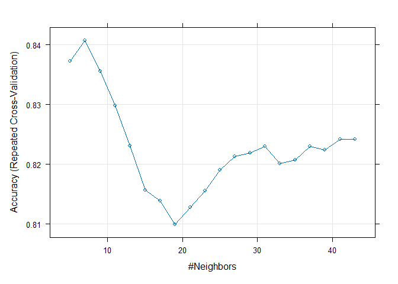

Individual Assigment 7
================
Samarth
2025-04-11

## R Markdown

This is an R Markdown document. Markdown is a simple formatting syntax
for authoring HTML, PDF, and MS Word documents. For more details on
using R Markdown see <http://rmarkdown.rstudio.com>.

When you click the **Knit** button a document will be generated that
includes both content as well as the output of any embedded R code
chunks within the document. You can embed an R code chunk like this:

``` r
summary(cars)
```

    ##      speed           dist       
    ##  Min.   : 4.0   Min.   :  2.00  
    ##  1st Qu.:12.0   1st Qu.: 26.00  
    ##  Median :15.0   Median : 36.00  
    ##  Mean   :15.4   Mean   : 42.98  
    ##  3rd Qu.:19.0   3rd Qu.: 56.00  
    ##  Max.   :25.0   Max.   :120.00

## Including Plots

You can also embed plots, for example:

<!-- -->

Note that the `echo = FALSE` parameter was added to the code chunk to
prevent printing of the R code that generated the plot.

\##Item 1, Loading Packages \[Code Chunk\]: Load the caret and ranger
libraries.

``` r
library(caret)
```

    ## Warning: package 'caret' was built under R version 4.4.3

    ## Loading required package: ggplot2

    ## Warning: package 'ggplot2' was built under R version 4.4.3

    ## Loading required package: lattice

``` r
library(dplyr)
```

    ## Warning: package 'dplyr' was built under R version 4.4.3

    ## 
    ## Attaching package: 'dplyr'

    ## The following objects are masked from 'package:stats':
    ## 
    ##     filter, lag

    ## The following objects are masked from 'package:base':
    ## 
    ##     intersect, setdiff, setequal, union

``` r
library(ranger)
```

    ## Warning: package 'ranger' was built under R version 4.4.3

\##Item 2, Importing Data \[Code Chunk\]: Import the Star Wars.csv file
into an R data frame

``` r
starwars <- read.csv("C:/Users/Sam/Desktop/UMass Sem II/655 ML for A/Assignments/Individual Assignment 7/Star Wars.csv")
```

``` r
##3. Exploring data
head(starwars)
```

    ##   Saw.Most.Recent Fan Films.Seen Prev.Avg.Rating Han.Solo Princess.Leia
    ## 1               1   1          5             4.0        3             3
    ## 2               1   0          2             3.6        3             3
    ## 3               1   1          5             4.0        3             3
    ## 4               1   1          5             3.0        3             3
    ## 5               1   1          5             3.6        3             3
    ## 6               1   1          5             3.4        3             3
    ##   Anakin.Skywalker Darth.Vader Expanded.Universe.Fan Star.Trek.Fan Age
    ## 1                3           3                     1             0  23
    ## 2                3           2                     0             0  28
    ## 3                3           3                     0             1  24
    ## 4                1           3                     1             0  23
    ## 5                3           3                     1             1  20
    ## 6                3           3                     1             0  28
    ##   Household.Income EducationIndex EastCoastResident
    ## 1            28406              2                 1
    ## 2              109              2                 0
    ## 3           139550              3                 0
    ## 4           102860              3                 0
    ## 5            47637              3                 1
    ## 6           136692              2                 0

``` r
nrow(starwars)
```

    ## [1] 835

\##Item 3, Pre-processing data \[Code Chunk\]: Change the Saw Most
Recent variable to a categorical variable for the purpose of binary
classification.

``` r
starwars$Saw.Most.Recent <- factor(starwars$Saw.Most.Recent, levels = c(0, 1))
```

\##Item 4a, Partitioning Data \[Code Chunk\]: Set the random seed to
1234.

``` r
set.seed(1234)
```

\##Item 4b, Partitioning Data \[Code Chunk\]: Partition training &
validation datasets; put 70% of the data into training and the rest into
validation.

``` r
sample <- sample.int(n = nrow(starwars), size = nrow(starwars)*0.7, replace = F)
starwars_train <- starwars[sample, ] ##Yields training dataset that is the training percentage % 
starwars_validation <- starwars[-sample, ] ##Yields validation dataset
```

\##Item 5, Normalizing Data Partitions \[Code Chunk\]: Normalize the
training and validation data partitions.Make sure the normalized
partitions are saved into new data frames as was shown in class.

``` r
preProcValues <- preProcess(starwars, method = c("range")) ##Uses column minimums & maximums to normalize values around 0 using original data

starwars_train_norm <- predict(preProcValues, starwars_train) #Using the normalizing object, normalize the rows in the dataframe and save it new to a new one

starwars_validation_norm <- predict(preProcValues, starwars_validation) #Using the normalizing object, normalize the rows in the dataframe and save it new to a new one
```

\##Item 6a, Training k-nearest neighbors model \[Code Chunk\]: Train a
k-nearest neighbors model on the normalized training data. Make sure to
display the performance of various values of k, as well as plot the
accuracy of various values of k.

\##Item 6b, Training k-nearest neighbors model \[Text\]: What value of k
produces the best accuracy?

``` r
ctrl <- trainControl(method="repeatedcv",repeats = 3)  #Set training parameters

knnFit <- train(Saw.Most.Recent ~ ., data = starwars_train_norm, method = "knn", trControl = ctrl, tuneLength = 20) #Test various values of k on normalized training data.

knnFit ##Displays the relative performance of different values of k
```

    ## k-Nearest Neighbors 
    ## 
    ## 584 samples
    ##  13 predictor
    ##   2 classes: '0', '1' 
    ## 
    ## No pre-processing
    ## Resampling: Cross-Validated (10 fold, repeated 3 times) 
    ## Summary of sample sizes: 525, 526, 526, 526, 526, 526, ... 
    ## Resampling results across tuning parameters:
    ## 
    ##   k   Accuracy   Kappa    
    ##    5  0.8372940  0.6093563
    ##    7  0.8407423  0.6178134
    ##    9  0.8356091  0.6034454
    ##   11  0.8298815  0.5908723
    ##   13  0.8230619  0.5722698
    ##   15  0.8156582  0.5527054
    ##   17  0.8139347  0.5506057
    ##   19  0.8099308  0.5401561
    ##   21  0.8127755  0.5468358
    ##   23  0.8156101  0.5542481
    ##   25  0.8190097  0.5612731
    ##   27  0.8212991  0.5652896
    ##   29  0.8218930  0.5666182
    ##   31  0.8230135  0.5682000
    ##   33  0.8201594  0.5608552
    ##   35  0.8207341  0.5621528
    ##   37  0.8230135  0.5654352
    ##   39  0.8224291  0.5642974
    ##   41  0.8241532  0.5686059
    ##   43  0.8241532  0.5681413
    ## 
    ## Accuracy was used to select the optimal model using the largest value.
    ## The final value used for the model was k = 7.

``` r
plot(knnFit) #Plot the accuracy of various k values
```

<!-- --> \##Item 6b,
Training k-nearest neighbors model \[Text\]: What value of k produces
the best accuracy? \##As we can see above, k=7 produces best
accuracy.This means that for every data record that we want to classify,
we will look at the 7 most similar data records and use their value for
Saw.Most.Recent to make a classification. .We chose k=7 because this
produced the highest classification accuracy. Choosing a value of k that
is too low –\> risk of overfitting; k too high –\> risk of underfitting.

\##Item 7, kNN Predictions \[Code Chunk\]: Generate kNN predictions for
the normalized validation data.

``` r
knn_validation_predictions <- predict(knnFit,newdata = starwars_validation_norm) #Generate validation data predictions
```

\##Item 8, Training random forest model \[Code Chunk\]: Train a random
forest model on the training data partition (not normalized data)

``` r
rf_fit <- train(Saw.Most.Recent ~ ., data = starwars_train, method = "ranger") ##Does not need to use normalized data so using original training partition
rf_fit
```

    ## Random Forest 
    ## 
    ## 584 samples
    ##  13 predictor
    ##   2 classes: '0', '1' 
    ## 
    ## No pre-processing
    ## Resampling: Bootstrapped (25 reps) 
    ## Summary of sample sizes: 584, 584, 584, 584, 584, 584, ... 
    ## Resampling results across tuning parameters:
    ## 
    ##   mtry  splitrule   Accuracy   Kappa    
    ##    2    gini        0.8803005  0.7194468
    ##    2    extratrees  0.8736950  0.6975102
    ##    7    gini        0.8843804  0.7349284
    ##    7    extratrees  0.8809092  0.7264922
    ##   13    gini        0.8806252  0.7260176
    ##   13    extratrees  0.8814936  0.7258133
    ## 
    ## Tuning parameter 'min.node.size' was held constant at a value of 1
    ## Accuracy was used to select the optimal model using the largest value.
    ## The final values used for the model were mtry = 7, splitrule = gini
    ##  and min.node.size = 1.

\##Item 9, Random forest predictions \[Code Chunk\]: Generate random
forest predictions on validation data partition (not normalized)

``` r
rf_validation_predictions <- predict(rf_fit, starwars_validation)
```

\##Item 10a, Validation Confusion Matrices \[Code Chunk\]: Produce the
confusion matrix for the random forest model’s predictions on the
validation data.

``` r
confusionMatrix(rf_validation_predictions, starwars_validation$Saw.Most.Recent,positive="1") ##Random forest validation predictions 
```

    ## Confusion Matrix and Statistics
    ## 
    ##           Reference
    ## Prediction   0   1
    ##          0  85  10
    ##          1  19 137
    ##                                           
    ##                Accuracy : 0.8845          
    ##                  95% CI : (0.8383, 0.9212)
    ##     No Information Rate : 0.5857          
    ##     P-Value [Acc > NIR] : <2e-16          
    ##                                           
    ##                   Kappa : 0.7589          
    ##                                           
    ##  Mcnemar's Test P-Value : 0.1374          
    ##                                           
    ##             Sensitivity : 0.9320          
    ##             Specificity : 0.8173          
    ##          Pos Pred Value : 0.8782          
    ##          Neg Pred Value : 0.8947          
    ##              Prevalence : 0.5857          
    ##          Detection Rate : 0.5458          
    ##    Detection Prevalence : 0.6215          
    ##       Balanced Accuracy : 0.8746          
    ##                                           
    ##        'Positive' Class : 1               
    ## 

\##Item 10b, Validation Confusion Matrices \[Code Chunk\]: Produce the
confusion matrix for the k-nearest neighbor’s model’s predictions on the
validation data.

``` r
confusionMatrix(knn_validation_predictions, starwars_validation_norm$Saw.Most.Recent,positive="1") ##kNN validation predictions
```

    ## Confusion Matrix and Statistics
    ## 
    ##           Reference
    ## Prediction   0   1
    ##          0  62   7
    ##          1  42 140
    ##                                           
    ##                Accuracy : 0.8048          
    ##                  95% CI : (0.7503, 0.8519)
    ##     No Information Rate : 0.5857          
    ##     P-Value [Acc > NIR] : 1.297e-13       
    ##                                           
    ##                   Kappa : 0.5769          
    ##                                           
    ##  Mcnemar's Test P-Value : 1.191e-06       
    ##                                           
    ##             Sensitivity : 0.9524          
    ##             Specificity : 0.5962          
    ##          Pos Pred Value : 0.7692          
    ##          Neg Pred Value : 0.8986          
    ##              Prevalence : 0.5857          
    ##          Detection Rate : 0.5578          
    ##    Detection Prevalence : 0.7251          
    ##       Balanced Accuracy : 0.7743          
    ##                                           
    ##        'Positive' Class : 1               
    ## 

\##Item 10c, Validation Confusion Matrices \[Text\]: Compare and
contrast the performance of the k-nearest neighbors and the random
forest models. Which model would you use? Use at least 2 performance
metrics to support your answer. \##Accuracy is better for random
forest(0.8845) than K-nearest neighbour(0.8048). Sensitivity is better
for K-nearest neighbour(0.9524) than random forest(0.9320). Specificity
is better for random forest(0.8173) than K-nearest
neighbour(0.5962).Overall Random Forest is better because it has higher
accuracy and better balance between sensitivity and specificity, and
more reliable predictions (higher precision). KNN has higher sensitivity
but is prone to false positives.
