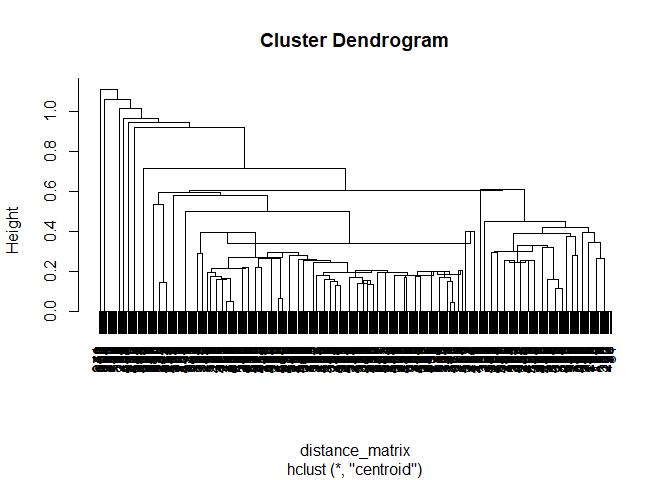
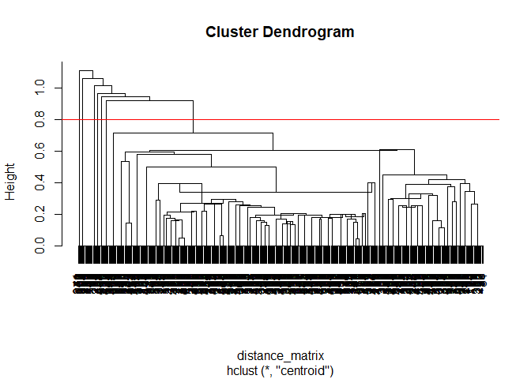
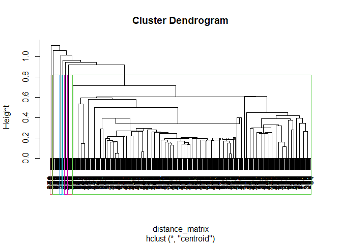

IA 8
================
Samarth
2025-04-23

## R Markdown

This is an R Markdown document. Markdown is a simple formatting syntax
for authoring HTML, PDF, and MS Word documents. For more details on
using R Markdown see <http://rmarkdown.rstudio.com>.

When you click the **Knit** button a document will be generated that
includes both content as well as the output of any embedded R code
chunks within the document. You can embed an R code chunk like this:

``` r
summary(cars)
```

    ##      speed           dist       
    ##  Min.   : 4.0   Min.   :  2.00  
    ##  1st Qu.:12.0   1st Qu.: 26.00  
    ##  Median :15.0   Median : 36.00  
    ##  Mean   :15.4   Mean   : 42.98  
    ##  3rd Qu.:19.0   3rd Qu.: 56.00  
    ##  Max.   :25.0   Max.   :120.00

## Including Plots

You can also embed plots, for example:

<!-- -->

Note that the `echo = FALSE` parameter was added to the code chunk to
prevent printing of the R code that generated the plot.

\##Item 1, Loading Packages \[Code Chunk\]: Load the caret, dplyr, and
ggplot2 libraries.

``` r
library(caret)
```

    ## Warning: package 'caret' was built under R version 4.4.3

    ## Loading required package: ggplot2

    ## Warning: package 'ggplot2' was built under R version 4.4.3

    ## Loading required package: lattice

``` r
library(dplyr)
```

    ## Warning: package 'dplyr' was built under R version 4.4.3

    ## 
    ## Attaching package: 'dplyr'

    ## The following objects are masked from 'package:stats':
    ## 
    ##     filter, lag

    ## The following objects are masked from 'package:base':
    ## 
    ##     intersect, setdiff, setequal, union

``` r
library(ggplot2)
```

## Item 2, Importing Data \[Code Chunk\]: Import the Cereals.csv file into an R data frame called “cereals”.

``` r
cereals <- read.csv("C:/Users/Sam/Desktop/UMass Sem II/655 ML for A/Assignments/Individual Assignment 8/Cereals.csv")
head(cereals)
```

    ##   Cereal.Product.ID Cold Calories Protein  Fat Sodium Fiber Sugar..Carb.Ratio
    ## 1                 1    1     23.1    1.32 0.33   42.9 3.300         0.5454545
    ## 2                 2    1    120.0    3.00 5.00   15.0 2.000         0.5000000
    ## 3                 3    1     23.1    1.32 0.33   85.8 2.970         0.4166667
    ## 4                 4    1     25.0    2.00 0.00   70.0 7.000         0.0000000
    ## 5                 5    1     82.5    1.50 1.50  150.0 0.750         0.3636364
    ## 6                 6    1     82.5    1.50 1.50  135.0 1.125         0.4878049
    ##   Potassium Consumer.Rating American.Cereal
    ## 1      92.4        68.40297               1
    ## 2     135.0        33.98368               1
    ## 3     105.6        59.42551               0
    ## 4     165.0        93.70491               0
    ## 5       0.0        34.38484               0
    ## 6       0.0        29.50954               0

``` r
nrow(cereals)
```

    ## [1] 462

\##Item 3, Pre-processing data \[Code Chunk\]: Normalize the data for
hierarchical clustering, and save it in a new dataframe. Make sure that
your normalized dataframe does not have the unique identifier column
(Cereal Product ID) in it.

``` r
cereals_SUBSET = subset(cereals, select = -c(Cereal.Product.ID) ) ##Remove unique identifier column

preProcValues <- preProcess(cereals_SUBSET, method = c("range")) ##Uses column minimums & maximums to normalize values around 0 using original data

cereals_norm <- predict(preProcValues, cereals_SUBSET) #Using the normalizing object, normalize the rows in the dataframe and save it new to a new one
```

\##Item 4, Assessing Observation Similarity \[Code Chunk\]: Produce a
distance matrix using the normalized data. Make sure the distance metric
you are using is Euclidean distance.

``` r
distance_matrix <- dist(cereals_norm, method = 'euclidean')
```

\##Item 5, Generating Hierarchical Clustering \[Code Chunk\]: Using
centroid linkage, run hierarchical clustering on the distance matrix.
Plot the resulting dendrogram.

``` r
CLUST <- hclust(distance_matrix, method = 'centroid') ##Centroid linkage
plot(CLUST) ##Plot dendrogram
```

<!-- --> \##Item 6a,
Setting Inter-Cluster Distance Cutoff \[Code Chunk\]: Plot the
dendrogram again, but this time set a cut-off line on the graph for a
desired inter-cluster distance of 0.8.

``` r
plot(CLUST) ##Plot dendrogram again
abline(h = 0.8, col = 'red') ##Sets & draws a cut-off line at desired inter-cluster distance on dendrogram
```

<!-- --> \##Item 6b,
Setting Inter-Cluster Distance Cutoff \[Text\]: How many clusters are
produced at this cut-off? \## Ans: At this cut-off, 7 clusters are
produced.

\##Item 7, Visualizing Clusters \[Code Chunk\]: Plot the dendrogram
again. This time, visualize the number of clusters from indicated in 6b.

``` r
plot(CLUST)
rect.hclust(CLUST , k = 7, border = 2:6)
```

<!-- -->

\##Item 8, Assigning Clusters \[Code Chunk\]: Using the number of
clusters from 6b, assign each data record in the original data to a
cluster. Save this in a new data frame called cereals_clustered.

``` r
cluster_data <- cutree(CLUST, k = 7)
cereals_clustered <- mutate(cereals, cluster = cluster_data) ##Add column to original data frame specifying which cluster each record belongs to
```

## Item 9, Evaluating Clusters \[Code Chunk\]: Run code to display how many records were placed into each cluster.

``` r
count(cereals_clustered,cluster)
```

    ##   cluster   n
    ## 1       1 423
    ## 2       2   4
    ## 3       3   4
    ## 4       4   6
    ## 5       5  13
    ## 6       6   8
    ## 7       7   4
