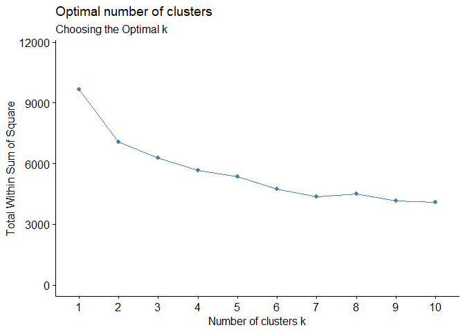

IA 9
================
Samarth
2025-05-01

## R Markdown

This is an R Markdown document. Markdown is a simple formatting syntax
for authoring HTML, PDF, and MS Word documents. For more details on
using R Markdown see <http://rmarkdown.rstudio.com>.

When you click the **Knit** button a document will be generated that
includes both content as well as the output of any embedded R code
chunks within the document. You can embed an R code chunk like this:

``` r
summary(cars)
```

    ##      speed           dist       
    ##  Min.   : 4.0   Min.   :  2.00  
    ##  1st Qu.:12.0   1st Qu.: 26.00  
    ##  Median :15.0   Median : 36.00  
    ##  Mean   :15.4   Mean   : 42.98  
    ##  3rd Qu.:19.0   3rd Qu.: 56.00  
    ##  Max.   :25.0   Max.   :120.00

\##Item 1 \[Code Chunk\]. Loading packages: Load the factoextra library.

``` r
library(caret)
```

    ## Warning: package 'caret' was built under R version 4.4.3

    ## Loading required package: ggplot2

    ## Warning: package 'ggplot2' was built under R version 4.4.3

    ## Loading required package: lattice

``` r
library(dplyr)
```

    ## Warning: package 'dplyr' was built under R version 4.4.3

    ## 
    ## Attaching package: 'dplyr'

    ## The following objects are masked from 'package:stats':
    ## 
    ##     filter, lag

    ## The following objects are masked from 'package:base':
    ## 
    ##     intersect, setdiff, setequal, union

``` r
library(factoextra)
```

    ## Warning: package 'factoextra' was built under R version 4.4.3

    ## Welcome! Want to learn more? See two factoextra-related books at https://goo.gl/ve3WBa

\##Item 2 \[Code Chunk\]. Random seed: Set the random seed to 1234.

``` r
set.seed(1234)
```

\##Item 3 \[Code Chunk\]. Importing data: Import the Dating App
Reviews.csv file into a dataframe called ‘datingappreviews’.

``` r
 datingappreviews<- read.csv("C:/Users/Sam/Desktop/UMass Sem II/655 ML for A/Assignments/Individual Assignment 9/Dating App Reviews.csv") 
head(datingappreviews)
```

    ##   Review.ID Bugs UI.UX Installation Photos Profile Likes Matches Chat Spam
    ## 1         1    0     0            0      1       1     0       0    0    0
    ## 2         2    0     0            1      0       0     0       0    1    1
    ## 3         3    1     0            0      1       1     1       0    0    0
    ## 4         4    0     0            0      1       1     1       0    0    0
    ## 5         5    0     0            0      1       1     1       0    0    0
    ## 6         6    0     0            0      1       0     1       0    0    0
    ##   Swiping Meetings Dates Friends Fun Location Relationship
    ## 1       0        0     0       0   0        1            0
    ## 2       0        0     0       0   0        0            0
    ## 3       0        0     0       0   0        0            0
    ## 4       1        0     0       0   0        1            0
    ## 5       0        0     0       0   0        1            0
    ## 6       0        0     0       0   0        0            0

\##Item 4 \[Code Chunk\]. Removing unique identifier(s): Remove the
unique identifier for each review from the dataframe, and save it into a
new dataframe called ‘datingappreviews_subset’.

``` r
datingappreviews_subset = subset(datingappreviews, select = -c(Review.ID) ) ##Remove unique identifier column
```

\##Item 5a \[Code Chunk\]. Choosing optimal k: Using
datingappreviews_subset, plot the within-cluster sum of squares for
various numbers of clusters. Make sure the y-axis goes from 0 to 11,500.

``` r
fviz_nbclust(datingappreviews_subset, kmeans, method = "wss") + labs(subtitle = "Choosing the Optimal k") +ylim(0,11500) ##Plot the within-cluster sum of squares as a function of the number of clusters to determine the optimal k
```

    ## Warning: The `size` argument of `element_line()` is deprecated as of ggplot2 3.4.0.
    ## ℹ Please use the `linewidth` argument instead.
    ## ℹ The deprecated feature was likely used in the ggpubr package.
    ##   Please report the issue at <https://github.com/kassambara/ggpubr/issues>.
    ## This warning is displayed once every 8 hours.
    ## Call `lifecycle::last_lifecycle_warnings()` to see where this warning was
    ## generated.

    ## Warning: The `size` argument of `element_rect()` is deprecated as of ggplot2 3.4.0.
    ## ℹ Please use the `linewidth` argument instead.
    ## ℹ The deprecated feature was likely used in the ggpubr package.
    ##   Please report the issue at <https://github.com/kassambara/ggpubr/issues>.
    ## This warning is displayed once every 8 hours.
    ## Call `lifecycle::last_lifecycle_warnings()` to see where this warning was
    ## generated.

    ## Warning: Using `size` aesthetic for lines was deprecated in ggplot2 3.4.0.
    ## ℹ Please use `linewidth` instead.
    ## ℹ The deprecated feature was likely used in the ggpubr package.
    ##   Please report the issue at <https://github.com/kassambara/ggpubr/issues>.
    ## This warning is displayed once every 8 hours.
    ## Call `lifecycle::last_lifecycle_warnings()` to see where this warning was
    ## generated.

<!-- --> \##Item 5b
\[Text\]. Choosing optimal k: Using the elbow method and the graph you
created for Item 5a, identify what the optimal number of clusters is.
Justify your answer. \## Ans: We want to minimize within sum squares,
i.e within the cluster distance to make sure our clusters are more
homogenous. Based on the elbow method, 7 appears to be optimal number of
clusters since after 7 the graph stabilizes and after that there is not
much variation in within sum of squares.

\##Item 6 \[Code Chunk\]. K-means clustering: Run k-means clustering on
datingappreviews_subset using the number of clusters you identified in
Item 5b.

``` r
kmeans_7 <- kmeans(datingappreviews_subset,7,nstart=25)
```

\##Item 7a \[Code Chunk\]. Cluster centroids: Output the resulting
cluster centroids.

``` r
kmeans_7$centers #Return cluster centroids
```

    ##          Bugs       UI.UX Installation     Photos    Profile      Likes
    ## 1 0.017915309 0.009771987  0.102605863 1.00000000 0.79641694 0.07003257
    ## 2 0.014230272 0.002587322  0.001293661 0.03234153 0.23027167 0.13454075
    ## 3 0.040404040 0.040404040  0.234343434 0.00000000 0.40808081 1.00000000
    ## 4 0.016736402 0.008368201  0.148535565 0.03765690 0.21338912 0.28242678
    ## 5 0.996478873 1.000000000  0.644366197 0.24647887 0.17253521 0.05985915
    ## 6 0.004201681 0.002100840  1.000000000 0.04621849 0.08403361 0.03571429
    ## 7 0.075697211 0.071713147  0.165338645 0.21115538 0.40039841 0.94023904
    ##      Matches      Chat        Spam    Swiping    Meetings      Dates    Friends
    ## 1 0.03583062 0.1221498 0.061889251 0.02768730 0.001628664 0.01628664 0.08794788
    ## 2 0.45407503 0.0000000 0.228978008 0.09831824 0.148771022 0.04657180 0.10219922
    ## 3 0.96161616 0.9616162 0.002020202 0.94949495 0.997979798 0.98585859 1.00000000
    ## 4 0.75104603 1.0000000 0.294979079 0.07322176 0.089958159 0.03347280 0.10460251
    ## 5 0.19366197 0.2429577 0.073943662 0.02464789 0.049295775 0.01056338 0.04577465
    ## 6 0.14495798 0.1533613 0.147058824 0.03151261 0.027310924 0.02100840 0.06092437
    ## 7 0.23306773 0.1414343 0.023904382 0.08764940 0.280876494 0.08764940 0.99800797
    ##          Fun   Location Relationship
    ## 1 0.04723127 0.15960912  0.016286645
    ## 2 0.06080207 0.22509702  0.010349288
    ## 3 0.60404040 0.09898990  0.997979798
    ## 4 0.05439331 0.09414226  0.018828452
    ## 5 0.02112676 0.08098592  0.000000000
    ## 6 0.02310924 0.17016807  0.004201681
    ## 7 0.03386454 0.10557769  0.370517928

\##Item 7b \[Text\]. Cluster centroids: Using the cluster centroids,
summarize the types of reviews that ended up in Cluster 5.  
\##Ans: Cluster 5 reviews are dominated by negative feedback focused on
bugs, poor user interface/design (UI/UX), and installation issues. Users
in this cluster are likely dissatisfied with the app’s technical
performance and usability, rather than its social or dating features
such as profile, likes, matches, span, swiping, meetings, dates etc.

\##Item 8a \[Code Chunk\]. Within-cluster sum of squares: Calculate the
within cluster sum of squares.

``` r
kmeans_7$withinss #Returns the within cluster sum of squares for each cluster
```

    ## [1]  531.9609 1051.6999  479.4828  661.4812  353.9049  401.6618  896.1594

\##Item 8b \[Text\]. Within-cluster sum of squares: Interpret the
within-cluster sum of squares. \##Ans: The within-cluster sum of squares
(WCSS) measures how compact each cluster is—the lower the WCSS, the more
tightly grouped the data points are around the cluster centroid. In our
case, Cluster 5 has the lowest WCSS (353.90), indicating it is the most
compact and thematically consistent cluster. In contrast, Cluster 2 has
the highest WCSS (1051.70), meaning it contains more dispersed and
varied reviews. Other clusters fall in between, showing moderate
cohesion. This suggests Cluster 5 captures a very focused review type,
while Cluster 2 may be mixing multiple themes.

\##Item 9a \[Code Chunk\]. Between-cluster sum of squares: Calculate the
between cluster sum of squares.

``` r
kmeans_7$betweenss #Returns the between cluster sum of squares
```

    ## [1] 5280.587

\##Item 9b \[Text\]. Between-cluster sum of squares: Interpret the
between-cluster sum of squares. \##Ans: The between-cluster sum of
squares (BCSS) value of 5280.587 reflects how distinct or well-separated
the clusters are from each other. A higher BCSS indicates that the
cluster centers are far apart, meaning the clusters capture different
patterns in the data well. When this value is large relative to the
total sum of squares (total variation in the data), it suggests that the
clustering model has done a good job of partitioning the data into
distinct and meaningful groups. In this case, a BCSS of 5280.587
supports that the clusters represent substantially different types of
reviews.

\##Item 10a \[Code Chunk\]. Explained variance: Calculate the explained
variance of the clustering.

``` r
explained_variance_7 <- kmeans_7$betweenss/kmeans_7$totss
explained_variance_7
```

    ## [1] 0.546818

\##Item 10b \[Text\]. Explained variance: Interpret the explained
variance metric. \##Ans: The explained variance of the clustering model
with 7 clusters is approximately 54.7%, meaning the model accounts for
just over half of the total variance in the dataset. This indicates a
moderate clustering performance, that is: the model captures some
meaningful patterns, but a significant portion of the data’s variation
(around 45%) remains unexplained. This could be due to overlapping
clusters or suboptimal choice of cluster number. Further tuning, such as
testing different values of k using an elbow plot may help improve
clustering quality.
